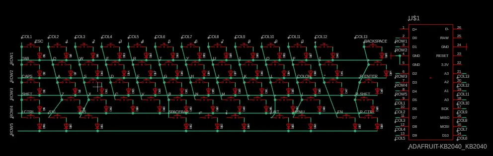
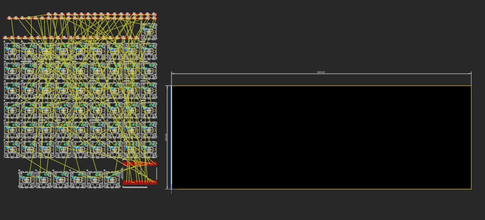
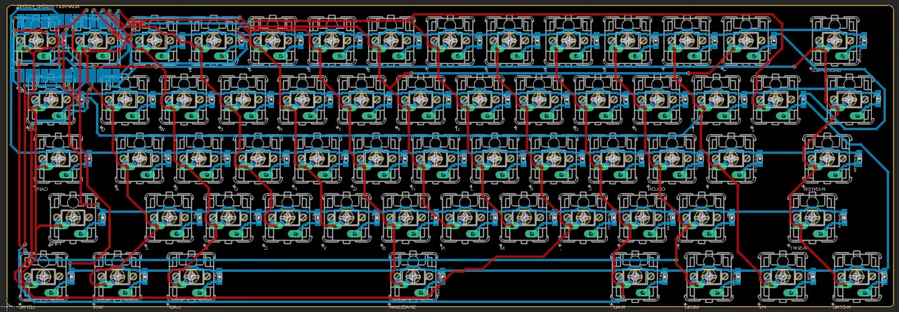
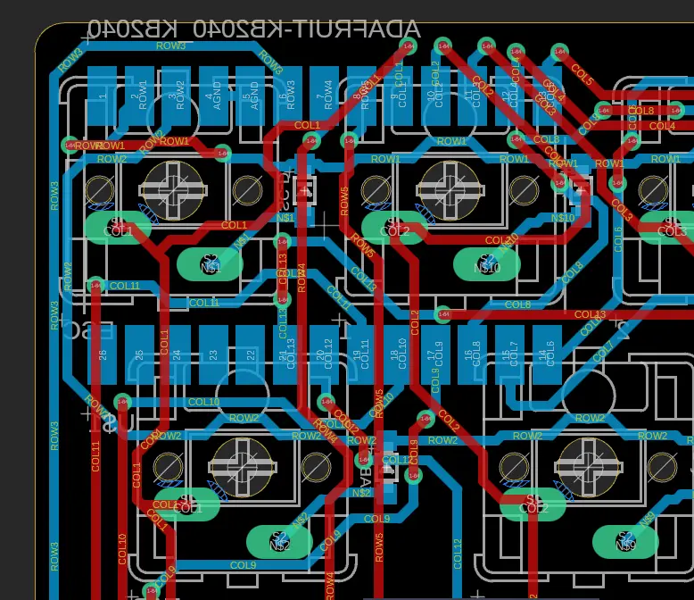
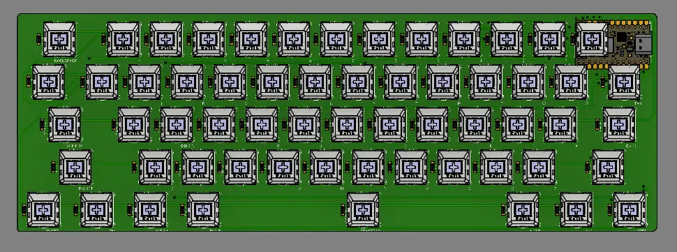
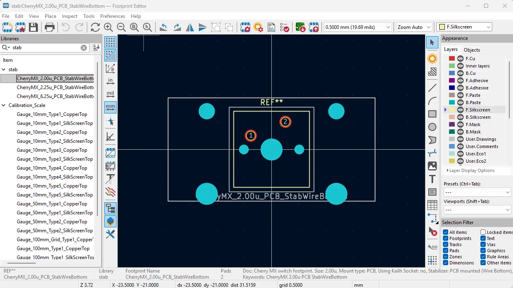
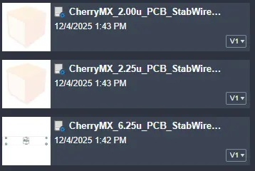

# junior week dec. 4, 2025

keyboard work bc i'm gonna send out the keyboard pcb with the macropad pcb at the same time to avoid double paying for shipping fees

## schematic

same thing as the macropad schematic, this time having more keys due to me making a 60% keyboard rather than a 2x4 macropad. i actually ran out of pins to use on the kb2040, so i had to create a 5x13 matrix rather than the standard 5x14 matrix

this meant i had **\=** and **\]** on the same row as r1, which is the bottom row of keysy

this won't change anything, but it will make wiring it slightly harder because it's not on the same row it's supposed to be on

###### the two keys next to the spacebar. they are **\=** and **\]** lol

## pcb

###### an image to show you just how much i needed to place. and i forgot to label diodes so i had to go back and label them

after a day of wiring and the worst pcb i've ever made, i was "done"

###### see following image to understand just how chopped this thing is..

i had to make some adjustments that i wasn't a fan of. i wasn't able to place the kb2040 vertically in the middle. i tried using pins and placing them between the switches, but still was unable to.

###### the sheer amount of via's i used is... yeah never let me make this ever again.

## 3d

well umm. i did the entire pcb wrong apparently.

accidently forgot to swap all the switches to be on top rather than bottom, and i couldn't just swap it or place the switches in the correct orientation when i got the board, so i had to fix it.

decided to take a break before redoing everything, and decided to create the rest of the keycaps

## keycaps

i found a model with all the keycaps, as my spacebar and a few other bigger keys (tab, caps lock, etc.) looked wrong, and i couldn't find drawings.

i just added a few fillets to make it easier to print, and started printing them

## problem two

so i never really accounted for stabilizers for bigger keys, and i couldn't find any footprints for the switch + stabilizer besides kicad ones

so i found out that kicad libraries can work, but these ones were from 6 years ago, and fusion wouldn't work with them.

using ai, i found out that i could just resave the libraries in kicad, and the libraries would be updated to the latest version

    <button class="slideshow-btn prev" type="button">‹</button>

                    
                    

<button class="slideshow-btn next" type="button">›</button>

with this all done, i put all the new footprints in the library and stole the symbols for the normal switches for it. i plan on creating a cardboard pcb of just the keys with stabilizers to test the ones i'm buying to see if it fits before getting the board shipped

next week i'll add the new stabilized footprints to the schematic and remake the entire pcb. i also printed the rest of the keycaps, and i'm stealing [miles'](https://www.mileshilliard.com/) keyboard to test them

    <a href="/blogs" class="buttons">← back to all blogs </a>
    <a href="/blogs/junior-blogs/12/" class="buttons"> last week's post →</a>

