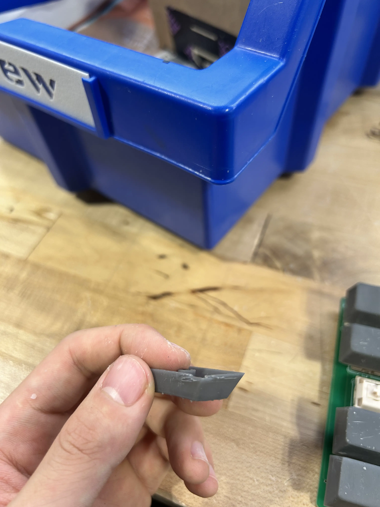
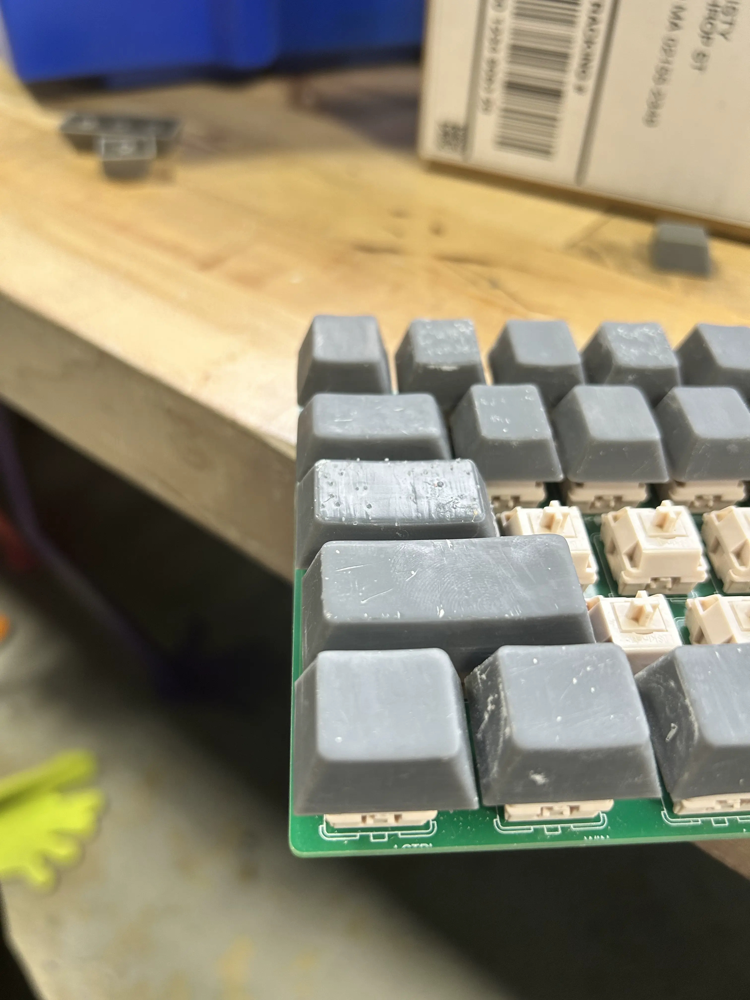
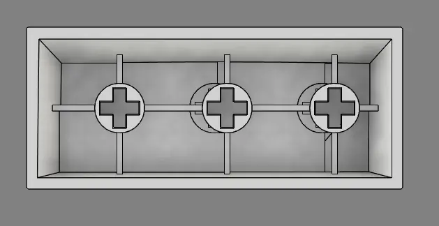

# junior week jan. 29, 2026

another 3 dayy week bc of snow days lol

finished sanding a few more keycaps, and this is what it looks like so far

###### all of r4, r3, and the non 1x1 keys printed and sanded. still needs to be painted

i switched from sandpaper to just using an xacto knife to clean the top, and sand the rest. cut myself in the progress lol.

but this method was way better than the last method. there were some problems however

###### tab key i believe

thank you resin printer for this amazing print.

i had another problem as well though.

i think i created the wrong plaacement for the footprint when making the pcb, leading to this unevenness on the side. thte right side doesn't have this problem, and because if it, it leads to this

###### as you can see, clicking the shift bar will also click the "z". this is a problem because this is a problem.

umm yeah so tim decided to help me fix this by just adjusting the location of the holes for the switch

###### work in progress

currently looks like this, but i'm doing some very illegal engineering methods to fix and clean it up. i'll provide an after photo next post.

    <a href="/blog.html" class="buttons">← back to all blogs </a>
    <a href="/blogs/junior-blogs/18/" class="buttons"> last week's post →</a>

