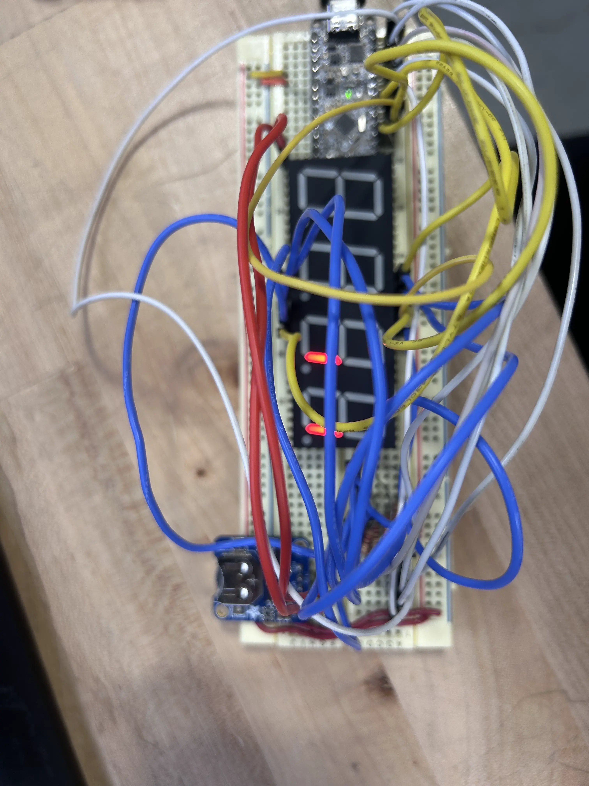
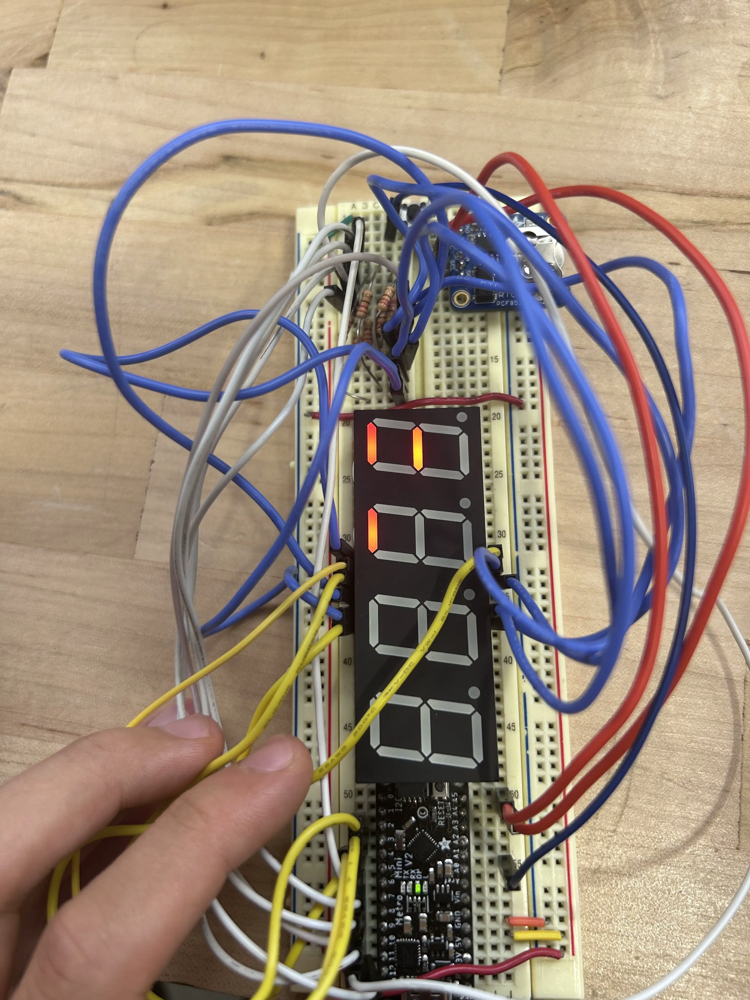

# junior week 9/15 - 9/19

hip hip hooray!

## seven seg stuff

started this week by deciding to switch from using a driver to back to manually setting the pins, this time through a library however.

originally wanted to use the driver if i used an esp, but since i didn't, i had enough pins to use on the metromini.

```cpp
#include "SevSeg.h"
#include "RTClib.h"

SevSeg sevseg;
RTC_PCF8523 rtc;

char daysOfTheWeek[7][12] = { "Sunday", "Monday", "Tuesday", "Wednesday", "Thursday", "Friday", "Saturday" };

void setup() {
  Serial.begin(57600);

  byte numDigits = 4;
  byte digitPins[] = { 2, 3, 4, 5 };
  byte segmentPins[] = { 6, 7, 8, 9, 10, 11, 12, 13 };
  bool resistorsOnSegments = false;      // 'false' means resistors are on digit pins
  byte hardwareConfig = COMMON_CATHODE;  // See README.md for options
  bool updateWithDelays = false;         // Default 'false' is Recommended
  bool leadingZeros = false;             // Use 'true' if you'd like to keep the leading zeros
  bool disableDecPoint = true;           // Use 'true' if your decimal point doesn't exist or isn't connected

  sevseg.begin(hardwareConfig, numDigits, digitPins, segmentPins, resistorsOnSegments,
                updateWithDelays, leadingZeros, disableDecPoint);
  sevseg.setBrightness(90);

  rtc.start();
  float drift = 43;                                // seconds plus or minus over oservation period - set to 0 to cancel previous calibration.
  float period_sec = (7 * 86400);                        // total obsevation period in seconds (86400 = seconds in 1 day:  7 days = (7 * 86400) seconds )
  float deviation_ppm = (drift / period_sec * 1000000);  //  deviation in parts per million (μs)
  float drift_unit = 4.34;                               // use with offset mode PCF8523_TwoHours
  // float drift_unit = 4.069; //For corrections every min the drift_unit is 4.069 ppm (use with offset mode PCF8523_OneMinute)
  int offset = round(deviation_ppm / drift_unit);
  // rtc.calibrate(PCF8523_TwoHours, offset); // Un-comment to perform calibration once drift (seconds) and observation period (seconds) are correct
  // rtc.calibrate(PCF8523_TwoHours, 0); // Un-comment to cancel previous calibration

  Serial.print("Offset is ");
  Serial.println(offset);

  if (!rtc.begin()) {
    while (1) {
      Serial.println("Couldn't find RTC");
      Serial.flush();
      delay(1000);
    }
  }
}

void loop() {
  DateTime now = rtc.now();

  static unsigned long timer = millis();
  static int seconds = 0;

  if (millis() - timer >= 1000) {
    timer += 1000;

    bool lunchTime = (now.hour() == 12 && now.minute() >= 20 && now.minute() <= 45);
    bool weekend = (now.dayOfTheWeek() == 0 || now.dayOfTheWeek() == 6);

    if (!lunchTime || !weekend) {
      seconds++;
      if (seconds == 10000) {
        seconds = 0;
      }
      sevseg.setNumber(seconds, 1);
    }
  }
  Serial.print(now.year(), DEC);
  Serial.print('/');
  Serial.print(now.month(), DEC);
  Serial.print('/');
  Serial.print(now.day(), DEC);
  Serial.print(" (");
  Serial.print(daysOfTheWeek[now.dayOfTheWeek()]);
  Serial.print(") ");
  Serial.print(now.hour(), DEC);
  Serial.print(':');
  Serial.print(now.minute(), DEC);
  Serial.print(':');
  Serial.print(now.second(), DEC);
  Serial.println();
  sevseg.refreshDisplay();
}
```

this was my first instance of my code with the rtc. i wanted to make it so that the counter wouldn't update during lunchtime or during weekends, as we aren't in shop.

however, in doing so my seven segment display didn't work. originally just not displaying anything

i spent most of my time trying to get a display, and i realized that it was due to having rtc library code in between seven segment code. (which impacted it for some reason).

after fixing that, i got some sort of display, but it was still broken.

<div class="slideshow">
  <button class="slideshow-btn prev" type="button">‹</button>
    <div class="slideshow-track">
      
      
    </div>
  <button class="slideshow-btn next" type="button">›</button>
</div>

i couldn't figure out what i was doing wrong, but eventually i realized that the segments that were on were trying to create the number that it was supposed to be printing.

i figured that there was something slowing the seven segment down, so i shifted the placement of the  ````sevseg.refreshDisplay();````  higher.

i also commented out the displays, and used an example library to test the seven segment again

<video controls muted>
    <source src="/static/vids/junior/3/7seg-test.mp4" type="video/mp4">
</video>

## rtc stuff

utilizing the rtc wasn't that hard. but i had an issue where the rtc was off by ~30 minutes and wouldn't adjust itself.

instead of calculating the drift and stuff, i decided to just swap the rtc with another one and use a battery in case the power gets cut off.
## done?

after fixing the seven segment and the rtc, i started to map the periods where we're in shop and add a reset button (for when accidents happen)
```cpp 
// NOTE: USING SERIAL / DELAYS WON'T CAUSE SEVEN SEG TO DISPLAY CORRECTLY

#include <SevSeg.h>
#include "RTClib.h"

SevSeg sevseg;
RTC_PCF8523 rtc;

char daysOfTheWeek[7][12] = { "Sunday", "Monday", "Tuesday", "Wednesday", "Thursday", "Friday", "Saturday" };

uint8_t prevHour;
const uint8_t resetButton = A0;

void setup() {
  pinMode(resetButton, INPUT_PULLUP);

  byte numDigits = 4;
  byte digitPins[] = { 2, 3, 4, 5 };
  byte segmentPins[] = { 6, 7, 8, 9, 10, 11, 12, 13};
  bool resistorsOnSegments = false;  // 'false' means resistors are on digit pins
  byte hardwareConfig = COMMON_CATHODE;
  bool updateWithDelays = false;  // Default 'false' is Recommended
  bool leadingZeros = false;      // Use 'true' if you'd like to keep the leading zeros
  bool disableDecPoint = true;    // Use 'true' if your decimal point doesn't exist or isn't connected

  sevseg.begin(hardwareConfig, numDigits, digitPins, segmentPins, resistorsOnSegments,
                updateWithDelays, leadingZeros, disableDecPoint);
  sevseg.setBrightness(95);

  Serial.begin(57600);

  if (!rtc.begin()) {
    Serial.println("Couldn't find RTC");
    Serial.flush();
    while (1) delay(10);
  }

  if (!rtc.initialized() || rtc.lostPower()) {
    Serial.println("RTC is NOT initialized, let's set the time!");
    rtc.adjust(DateTime(F(__DATE__), F(__TIME__)));
  }

  rtc.start();

  float drift = 43;                                // seconds plus or minus over oservation period - set to 0 to cancel previous calibration.
  float period_sec = (7 * 86400);                        // total obsevation period in seconds (86400 = seconds in 1 day:  7 days = (7 * 86400) seconds )
  float deviation_ppm = (drift / period_sec * 1000000);  //  deviation in parts per million (μs)
  float drift_unit = 4.34;                               // use with offset mode PCF8523_TwoHours
  // float drift_unit = 4.069; //For corrections every min the drift_unit is 4.069 ppm (use with offset mode PCF8523_OneMinute)
  uint8_t offset = round(deviation_ppm / drift_unit);

  // if u care abt offset
  //Serial.print("Offset is ");
  //Serial.println(offset);

  DateTime now = rtc.now();
  prevHour = now.hour(); // now.minute when debugging
}

void loop() {
  DateTime now = rtc.now();

  uint8_t currentHour = now.hour();  // now.minute when debugging
  uint8_t diff = (currentHour - prevHour + 24) % 24; // change 24 with 60 if debugging

  bool pFive = (now.hour() == 11 && now.minute() >= 27) || (now.hour() == 12 && now.minute() <= 18);
  bool pSix = (now.hour() == 12 && now.minute() >= 48) || (now.hour() == 13 && now.minute() <= 39);
  bool pSeven = (now.hour() == 13 && now.minute() >= 42) || (now.hour() == 14 && now.minute() <= 33);
  bool lunchTime = (now.hour() == 12 && (now.minute() >= 21 && now.minute() <= 45));
  bool weekend = (now.dayOfTheWeek() == 0 || now.dayOfTheWeek() == 6);

  static unsigned long counter = 0;

  if (diff == 1) {
    // skip increment during lunch or weekend
    if (!(lunchTime || weekend) && (pFive || pSix || pSeven)) {
      counter++;
      Serial.println("update");
      if (counter >= 10000) counter = 0;
    }
    else {
      Serial.println("no print");
    }
    prevHour = currentHour;  // record the hour we just handled
  }

  sevseg.setNumber(counter, 1);
  sevseg.refreshDisplay();

  uint8_t reset = digitalRead(resetButton);

  // button reset
  if (reset == LOW) {
    counter = 0;
    Serial.println("on");
  }
}
```

full code linked above. there is a problem where it updates every hour, rather than every 60 minutes (but i really don't care it's basically the same) (git repo soon)

<video controls muted>
    <source src="/static/vids/junior/3/reset.mp4" type="video/mp4">
</video>

## schematic

started working on the schematic, but didn't finish since i spent so much time debugging and trying to get the seven segment to work.

i got some basic wiring done, but haven't started wiring anything yet.

close to finishing. should be done by next week

<div class="navigation">
    <a href="/blog.html" class="buttons">← back to all blogs </a>
    <a href="/blogs/junior-blogs/2/" class="buttons"> last week's post →</a>
</div>